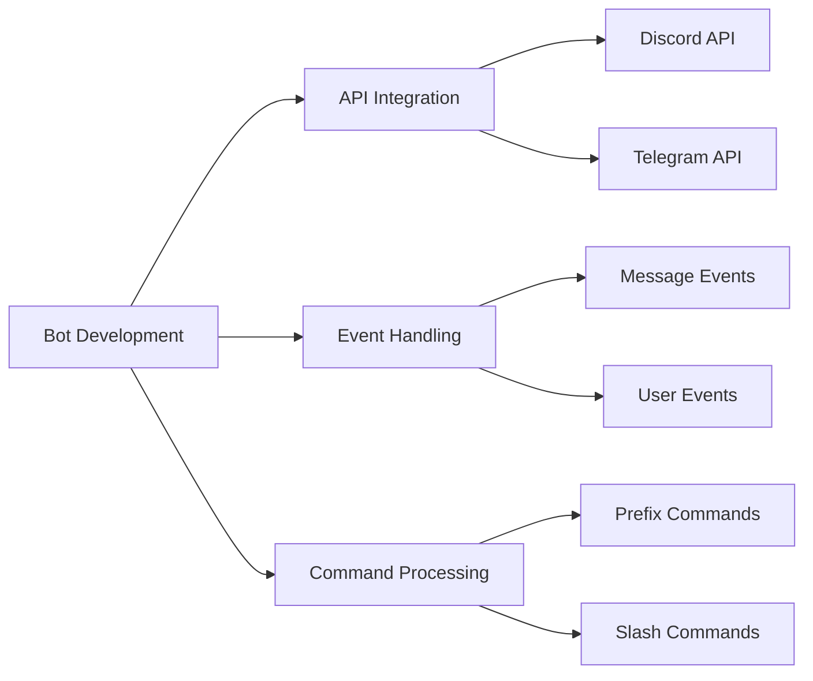

<div align="center">

# 🎮 OpenClaw Bot - Learning Edition

[](https://www.python.org/)
[](https://nodejs.org/)
[](https://discord.com/)
[](https://telegram.org/)

**Master Bot Development Through Building a Multi-Platform OpenClaw Game Server Manager**

[🚀 Quick Start](#-quick-start) • [📚 Learn](#-what-youll-learn) • [💻 Install](#-installation) • [⚙️ Configure](#-configuration) • [📖 Docs](#-understanding-the-architecture)

</div>

---

## 📚 What You'll Learn

<table>
<tr>
<td width="50%">

### 🐍 Python Track
- **Async Programming** with `asyncio`
- **Discord.py** framework & event handling
- **Python-telegram-bot** integration
- **Environment management** with `dotenv`
- **Error handling** & logging patterns
- **Virtual environments** & dependency management

</td>
<td width="50%">

### 📦 JavaScript Track
- **Modern ES6+** syntax & features
- **Discord.js v14** library
- **Telegraf** framework for Telegram
- **Promises & async/await** patterns
- **Node.js** runtime & npm ecosystem
- **Event-driven architecture**

</td>
</tr>
</table>

### 🎯 Core Concepts Covered



---

## 🔧 System Requirements

<table>
<tr>
<th>Component</th>
<th>Python</th>
<th>JavaScript</th>
</tr>
<tr>
<td><b>Runtime</b></td>
<td>Python 3.8+</td>
<td>Node.js 20.17.0+ / 22.9.0+</td>
</tr>
<tr>
<td><b>Package Manager</b></td>
<td>pip 21.0+</td>
<td>npm 10.0+ / yarn 1.22+</td>
</tr>
<tr>
<td><b>RAM</b></td>
<td>512 MB minimum</td>
<td>512 MB minimum</td>
</tr>
<tr>
<td><b>Storage</b></td>
<td>100 MB</td>
<td>200 MB</td>
</tr>
<tr>
<td><b>OS</b></td>
<td colspan="2">Windows 10+, Linux (Ubuntu 20.04+), macOS 11+</td>
</tr>
</table>

### 🛠️ Required Tools

| Tool | Purpose | Download |
|------|---------|----------|
| **Git** | Version control | [git-scm.com](https://git-scm.com/) |
| **VS Code** | Code editor (recommended) | [code.visualstudio.com](https://code.visualstudio.com/) |
| **Discord Account** | Bot token generation | [discord.com](https://discord.com/) |
| **Telegram Account** | Bot token (optional) | [telegram.org](https://telegram.org/) |

---

## 🚀 Quick Start

### Choose Your Path

<details>
<summary><b>🐍 Python Developer Path</b></summary>

```bash
# Clone repository
git clone https://github.com/yourusername/openclaw-bot.git
cd openclaw-bot

# Setup virtual environment
python -m venv venv
source venv/bin/activate  # Linux/macOS
# or
venv\Scripts\activate  # Windows

# Install dependencies
pip install -r requirements.txt

# Configure environment
cp .env.example .env
# Edit .env with your tokens

# Run bot
python main.py
```

</details>

<details>
<summary><b>📦 JavaScript Developer Path</b></summary>

```bash
# Clone repository
git clone https://github.com/yourusername/openclaw-bot.git
cd openclaw-bot

# Install dependencies
npm install
# or
yarn install

# Configure environment
cp .env.example .env
# Edit .env with your tokens

# Run bot
npm start
# or
node index.js
```

</details>

---

## 💻 Installation

### 📥 Step 1: Clone Repository

```bash
git clone https://github.com/yourusername/openclaw-bot.git
cd openclaw-bot
```

### 🐍 Python Setup

#### Virtual Environment (Isolation)

**Windows:**
```powershell
python -m venv venv
.\venv\Scripts\activate
```

**Linux/macOS:**
```bash
python3 -m venv venv
source venv/bin/activate
```

> 💡 **Why Virtual Environment?** Isolates project dependencies from system Python, preventing conflicts.

#### Install Dependencies

```bash
pip install --upgrade pip
pip install -r requirements.txt
```

**Core Libraries:**
```
discord.py==2.3.2          # Discord API wrapper
python-telegram-bot==20.7  # Telegram Bot API
python-dotenv==1.0.0       # Environment variables
aiohttp==3.9.1             # Async HTTP client
asyncio                    # Async I/O framework
```

### 📦 JavaScript Setup

#### Install Dependencies

```bash
npm install
# or
yarn install
```

**Core Libraries:**
```json
{
  "discord.js": "^14.14.1",
  "telegraf": "^4.15.0",
  "dotenv": "^16.3.1",
  "axios": "^1.6.2",
  "winston": "^3.11.0"
}
```

---

## ⚙️ Configuration

### 🔐 Environment Variables

Create `.env` file:

```bash
cp .env.example .env
```

**Configuration Template:**

```env
# ============================================
# DISCORD CONFIGURATION
# ============================================
DISCORD_TOKEN=your_discord_bot_token_here
CLIENT_ID=your_application_id_here
GUILD_ID=your_server_id_here

# ============================================
# TELEGRAM CONFIGURATION (Optional)
# ============================================
TELEGRAM_TOKEN=your_telegram_bot_token_here

# ============================================
# BOT SETTINGS
# ============================================
PREFIX=!
ENVIRONMENT=development
LOG_LEVEL=info

# ============================================
# DATABASE (Optional - Advanced)
# ============================================
DATABASE_URL=sqlite:///data/bot.db
REDIS_URL=redis://localhost:6379

# ============================================
# API SETTINGS (Optional)
# ============================================
API_PORT=3000
API_HOST=0.0.0.0
```

---

### 🤖 Discord Bot Setup

#### Step 1: Create Application

1. Navigate to [Discord Developer Portal](https://discord.com/developers/applications)
2. Click **"New Application"**
3. Name your application (e.g., "OpenClaw Learning Bot")
4. Accept Terms of Service

#### Step 2: Create Bot User

1. Go to **"Bot"** section (left sidebar)
2. Click **"Add Bot"**
3. Confirm by clicking **"Yes, do it!"**

#### Step 3: Configure Privileged Intents

Enable these **Gateway Intents**:

```
✅ PRESENCE INTENT          - Track user online/offline status
✅ SERVER MEMBERS INTENT    - Access member list & events
✅ MESSAGE CONTENT INTENT   - Read message content (required for commands)
```

> ⚠️ **Important:** Without MESSAGE CONTENT INTENT, your bot cannot read messages!

#### Step 4: Get Bot Token

1. Under **"Bot"** section, click **"Reset Token"**
2. Click **"Copy"** to copy your token
3. Add to `.env`:
   ```env
   DISCORD_TOKEN=your_discord_bot_token_placeholder
   ```

> 🔒 **Security:** Never commit `.env` to Git! Token = full bot access.

#### Step 5: OAuth2 & Permissions

**Required Permissions (Integer: 274878024768):**

| Permission | Purpose |
|------------|---------|
| View Channels | See server channels |
| Send Messages | Send responses |
| Send Messages in Threads | Thread support |
| Embed Links | Rich embeds |
| Attach Files | File uploads |
| Read Message History | Context awareness |
| Add Reactions | Interactive features |
| Use Slash Commands | Modern commands |

**Generate Invite URL:**

```
https://discord.com/api/oauth2/authorize?client_id=YOUR_CLIENT_ID&permissions=274878024768&scope=bot%20applications.commands
```

Replace `YOUR_CLIENT_ID` with your Application ID from **"General Information"**.

---

### 📱 Telegram Bot Setup

#### Step 1: Create Bot with BotFather

1. Open Telegram, search: `@BotFather`
2. Send: `/newbot`
3. Provide bot name: `OpenClaw Learning Bot`
4. Provide username: `openclaw_learning_bot` (must end with `bot`)

#### Step 2: Get Token

BotFather responds with:
```
Done! Congratulations on your new bot.
Token: your_telegram_bot_token_placeholder
```

Add to `.env`:
```env
TELEGRAM_TOKEN=your_telegram_bot_token_placeholder
```

#### Step 3: Configure Commands

Send `/setcommands` to BotFather, then paste:

```
help - Display all available commands
ping - Check bot response time
status - Show bot and server status
players - List active players
stats - Server statistics
info - Bot information
```

---

## 📖 Understanding the Architecture

### 🏗️ Project Structure

```
openclaw-bot/
├── 📁 src/
│   ├── 📁 commands/          # Command handlers
│   │   ├── help.py/js
│   │   ├── ping.py/js
│   │   └── status.py/js
│   ├── 📁 events/            # Event listeners
│   │   ├── ready.py/js
│   │   ├── message.py/js
│   │   └── error.py/js
│   ├── 📁 utils/             # Helper functions
│   │   ├── logger.py/js
│   │   ├── database.py/js
│   │   └── config.py/js
│   └── 📁 models/            # Data models
│       └── user.py/js
├── 📁 data/                  # Database & logs
├── 📁 tests/                 # Unit tests
├── main.py / index.js        # Entry point
├── requirements.txt          # Python deps
├── package.json              # Node.js deps
├── .env.example              # Config template
└── README.md                 # This file
```

### 🔄 Bot Lifecycle

```python
# Python Example
import discord
from discord.ext import commands

# 1. Initialize bot
bot = commands.Bot(command_prefix='!', intents=discord.Intents.all())

# 2. Event: Bot ready
@bot.event
async def on_ready():
    print(f'Logged in as {bot.user}')

# 3. Event: Message received
@bot.event
async def on_message(message):
    if message.author.bot:
        return
    await bot.process_commands(message)

# 4. Command: Ping
@bot.command()
async def ping(ctx):
    await ctx.send(f'Pong! {round(bot.latency * 1000)}ms')

# 5. Run bot
bot.run('TOKEN')
```

```javascript
// JavaScript Example
const { Client, GatewayIntentBits } = require('discord.js');

// 1. Initialize client
const client = new Client({
    intents: [
        GatewayIntentBits.Guilds,
        GatewayIntentBits.GuildMessages,
        GatewayIntentBits.MessageContent
    ]
});

// 2. Event: Bot ready
client.once('ready', () => {
    console.log(`Logged in as ${client.user.tag}`);
});

// 3. Event: Message received
client.on('messageCreate', async (message) => {
    if (message.author.bot) return;
    
    // 4. Command: Ping
    if (message.content === '!ping') {
        await message.reply(`Pong! ${client.ws.ping}ms`);
    }
});

// 5. Login
client.login('TOKEN');
```

---

## 🎨 Building Your First Command

### Exercise 1: Hello Command

<details>
<summary><b>🐍 Python Implementation</b></summary>

**File: `src/commands/hello.py`**

```python
from discord.ext import commands

class Hello(commands.Cog):
    """A simple hello command"""
    
    def __init__(self, bot):
        self.bot = bot
    
    @commands.command(name='hello', help='Greets the user')
    async def hello(self, ctx):
        """Responds with a personalized greeting"""
        await ctx.send(f'Hello, {ctx.author.mention}! 👋')

async def setup(bot):
    await bot.add_cog(Hello(bot))
```

**Load in `main.py`:**

```python
await bot.load_extension('src.commands.hello')
```

</details>

<details>
<summary><b>📦 JavaScript Implementation</b></summary>

**File: `src/commands/hello.js`**

```javascript
module.exports = {
    name: 'hello',
    description: 'Greets the user',
    execute(message) {
        message.reply(`Hello, ${message.author.username}! 👋`);
    }
};
```

**Load in `index.js`:**

```javascript
const helloCommand = require('./src/commands/hello');
// Register command...
```

</details>

### Exercise 2: Server Info Command

**Challenge:** Create a command that displays:
- Server name
- Total members
- Server creation date
- Server owner

<details>
<summary><b>💡 Hint</b></summary>

**Python:** Use `ctx.guild` object
```python
guild = ctx.guild
name = guild.name
members = guild.member_count
created = guild.created_at
owner = guild.owner
```

**JavaScript:** Use `message.guild` object
```javascript
const guild = message.guild;
const name = guild.name;
const members = guild.memberCount;
const created = guild.createdAt;
const owner = guild.owner;
```

</details>

---

## 🚀 Running the Bot

### Development Mode

**Python:**
```bash
# Activate virtual environment
source venv/bin/activate  # Linux/macOS
venv\Scripts\activate     # Windows

# Run with auto-reload (install watchdog)
pip install watchdog
python main.py --reload
```

**JavaScript:**
```bash
# Run with nodemon (auto-reload)
npm install -g nodemon
nodemon index.js

# Or use npm script
npm run dev
```

### Production Deployment

<details>
<summary><b>🔧 Using PM2 (Process Manager)</b></summary>

**Install PM2:**
```bash
npm install -g pm2
```

**Python:**
```bash
pm2 start main.py --name openclaw-bot --interpreter python3
pm2 save
pm2 startup
```

**JavaScript:**
```bash
pm2 start index.js --name openclaw-bot
pm2 save
pm2 startup
```

**PM2 Commands:**
```bash
pm2 list              # List all processes
pm2 logs openclaw-bot # View logs
pm2 restart openclaw-bot
pm2 stop openclaw-bot
pm2 delete openclaw-bot
```

</details>

<details>
<summary><b>🐧 Using systemd (Linux)</b></summary>

**Create service file:** `/etc/systemd/system/openclaw-bot.service`

```ini
[Unit]
Description=OpenClaw Bot
After=network.target

[Service]
Type=simple
User=your_username
WorkingDirectory=/path/to/openclaw-bot
Environment="PATH=/path/to/openclaw-bot/venv/bin"
ExecStart=/path/to/openclaw-bot/venv/bin/python main.py
Restart=always
RestartSec=10

[Install]
WantedBy=multi-user.target
```

**Enable & start:**
```bash
sudo systemctl daemon-reload
sudo systemctl enable openclaw-bot
sudo systemctl start openclaw-bot
sudo systemctl status openclaw-bot
```

</details>

---

## 🔍 Troubleshooting

### ❌ Bot Doesn't Start

<details>
<summary><b>Check Token</b></summary>

```bash
# Verify .env file exists
ls -la .env

# Check token format (should start with MTI...)
cat .env | grep DISCORD_TOKEN
```

**Common Issues:**
- Token has spaces
- Token is incomplete
- Using old/regenerated token

</details>

<details>
<summary><b>Check Dependencies</b></summary>

**Python:**
```bash
pip list | grep discord
pip install --upgrade discord.py
```

**JavaScript:**
```bash
npm list discord.js
npm install discord.js@latest
```

</details>

### ❌ Bot Online But Doesn't Respond

**Checklist:**
- ✅ MESSAGE CONTENT INTENT enabled?
- ✅ Bot has "Send Messages" permission?
- ✅ Using correct prefix (`!` by default)?
- ✅ Bot role above other roles?

**Debug Mode:**

**Python:**
```python
import logging
logging.basicConfig(level=logging.DEBUG)
```

**JavaScript:**
```javascript
client.on('debug', console.log);
```

### ❌ Module/Import Errors

**Python:**
```bash
# Reinstall in virtual environment
deactivate
rm -rf venv
python -m venv venv
source venv/bin/activate
pip install -r requirements.txt
```

**JavaScript:**
```bash
# Clear cache and reinstall
rm -rf node_modules package-lock.json
npm cache clean --force
npm install
```

### ❌ Node.js Version Error

```bash
# Check version
node --version

# Install correct version with nvm
curl -o- https://raw.githubusercontent.com/nvm-sh/nvm/v0.39.0/install.sh | bash
nvm install 20.17.0
nvm use 20.17.0
```

---

## 📚 Learning Resources

### 📖 Official Documentation

| Resource | Link |
|----------|------|
| Discord.py Docs | [discordpy.readthedocs.io](https://discordpy.readthedocs.io/) |
| Discord.js Guide | [discordjs.guide](https://discordjs.guide/) |
| Telegram Bot API | [core.telegram.org/bots](https://core.telegram.org/bots) |
| Python Async | [docs.python.org/3/library/asyncio](https://docs.python.org/3/library/asyncio.html) |

### 🎓 Tutorials & Courses

- [Discord.py Tutorial Series](https://www.youtube.com/watch?v=SPTfmiYiuok)
- [Discord.js Guide](https://discordjs.guide/)
- [Real Python - Async IO](https://realpython.com/async-io-python/)
- [Node.js Best Practices](https://github.com/goldbergyoni/nodebestpractices)

### 💬 Community

- [Discord.py Server](https://discord.gg/dpy)
- [Discord.js Server](https://discord.gg/djs)
- [r/discordapp](https://reddit.com/r/discordapp)

---

## 🎯 Learning Path

### Week 1: Basics
- [ ] Setup development environment
- [ ] Create first bot
- [ ] Implement ping command
- [ ] Understand events

### Week 2: Commands
- [ ] Create command handler
- [ ] Add help command
- [ ] Implement error handling
- [ ] Add logging

### Week 3: Advanced
- [ ] Database integration
- [ ] Slash commands
- [ ] Embeds & reactions
- [ ] Cogs/modules

### Week 4: Production
- [ ] Deploy bot
- [ ] Monitor performance
- [ ] Add analytics
- [ ] Documentation

---

## 🤝 Contributing

Contributions welcome! See [CONTRIBUTING.md](CONTRIBUTING.md)

```bash
# Fork & clone
git clone https://github.com/yourusername/openclaw-bot.git

# Create branch
git checkout -b feature/amazing-feature

# Commit changes
git commit -m "Add amazing feature"

# Push & create PR
git push origin feature/amazing-feature
```

---

## 📄 License

MIT License - See [LICENSE](LICENSE)

---

<div align="center">

**🎮 Happy Learning! Build Amazing Bots! 🚀**

Made with ❤️ for the OpenClaw Community

[⭐ Star on GitHub](https://github.com/yourusername/openclaw-bot) • [🐛 Report Bug](https://github.com/yourusername/openclaw-bot/issues) • [💡 Request Feature](https://github.com/yourusername/openclaw-bot/issues)

</div>
